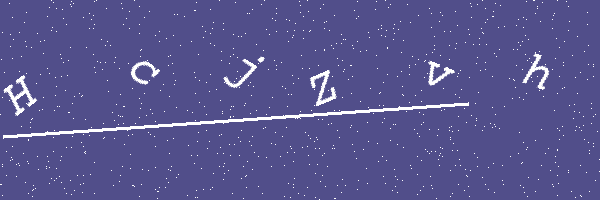

# PyCaptcha
Image and Audio captcha generation using python

## ImgageCaptcha
Initialisation with captcha customisation arguments
```
    image = ImageCaptcha()
```


### Captcha Height and Width
    c_height=200, c_width=600

#### Captcha Colors(default is "#B89843")  
Use hexadecimal colors, HTML color names, etc, use [Pil
 ImageColor
 Documents](https://pillow.readthedocs.io/en/3.1.x/reference/ImageColor.html
 ) for more details on color name.
    
    c_color

#### Captcha Font Type(InriaSerif-Regular.ttf by default)
Provide a ttf font path
    
    font_type
    
#### Font Color(default "WHITE")
    font_color

#### Font Size(default 50)
    font_size

#### String Length(default is 6)
String lenght for random captcha string. Inoperative if captch string is
 passed to generate function.
    
    string_length
    
#### String Constant(Defaults to combination of upper case, lower case, and numeric)
Fo random captcha String. provides a combination of string to include in the
 captcha example Lower case("L"), Upper Case("U"), Numeric("D"), Symbols("P
 "). Inoperative if captch string is passed to generate function.

    string_constants=("U", "L", "D")

### Generate Image
Generates captcha. If captcha string is not passed, generates a random string from Upper Case, Lower Case, and Number. The 
Specify noise density for noise on the captcha. Integer value represents the
 number of noise pixels on the captcha.
  
Returns captcha string

    captcha_string = image.save_image(captcha_string, noise_density)

### Show Captcha 
To see the Captcha Image

    image.show_image()

#### To bytes
Convert the image to bytes. The encoder argument defaults to "raw"
Returns bytes

    image_byte = image.im_bytes(encoder="raw")
    
## Audio Captcha Under Development
-------------------


# Resources
Using [Pillow](https://pillow.readthedocs.io/en/stable/) Python Imaging library for
 creating captcha images

Fonts from [Google Fonts](https://fonts.google.com/)